# NekoStay - Rescue Management System

Aplikasi manajemen shelter penyelamatan kucing jalanan berbasis Laravel 13. Aplikasi ini membantu tim rescue mengelola data kucing yang diselamatkan, mencatat riwayat medis, memproses pengajuan adopsi, serta mengelola akun staff — semuanya terpusat dalam satu dashboard dengan kontrol akses berbasis role (Admin & Staff). Dilengkapi REST API untuk integrasi eksternal dan tampilan yang responsif di berbagai perangkat.

## Video Demo

Video demonstrasi lengkap aplikasi NekoStay dapat ditonton di sini:
[https://drive.google.com/drive/folders/1NGEIS_QkkhPaQvAOGUkne_k1zvb_6a3s?usp=sharing](https://drive.google.com/drive/folders/1NGEIS_QkkhPaQvAOGUkne_k1zvb_6a3s?usp=sharing)

## Anggota Kelompok

| Nama | NIM | Kontribusi |
|---|---|---|
| Muhammad Nawa Bayhaqi | 230102092 | Setup project (auth, role, database), layout & dashboard, model & seeder, REST API, fitur Manage Staff, optimasi performa, perbaikan responsivitas mobile, redesign Profile Settings |
| Muhammad Fathi Ulumuddin | 230102086 | Desain UI/UX aplikasi (Figma), fitur Cat Management (controller, validasi, form create/edit) |
| Naufal Akbar Muhadzzib | 230102100 | Fitur Medical Records (CRUD rekam medis), redesign landing page & halaman Welcome/Login |
| Abdullah Nurhadi Krishnamurti | 230102003 | Perancangan ERD, halaman Welcome & Login, kontribusi fitur Adoption Requests |

## Fitur Utama

- **Autentikasi & Role Management** — Login dengan 2 role (Admin & Staff) menggunakan Laravel Breeze + Spatie Permission. Registrasi publik dinonaktifkan demi keamanan; akun staff hanya bisa dibuat oleh Admin melalui fitur Manage Staff.
- **Dashboard** — Ringkasan statistik shelter (total kucing, siap adopsi, berhasil diadopsi, pengajuan pending), grafik tren rescue vs adopsi bulanan (Chart.js), dan daftar aktivitas terbaru.
- **Manajemen Kucing (Cat Management)** — CRUD lengkap data kucing (nama, breed, umur, gender, warna, status, lokasi rescue, foto), dengan search, filter status, dan pagination.
- **Rekam Medis (Medical Records)** — Pencatatan riwayat kesehatan per kucing (diagnosis, treatment, berat badan, suhu tubuh, dokter), ditampilkan dalam timeline, dengan filter status (Healthy/Treatment/Recovery).
- **Manajemen Adopsi (Adoption Requests)** — Pengajuan adopsi oleh staff, approval/rejection oleh Admin, dengan sinkronisasi otomatis status kucing saat disetujui.
- **Manage Staff** — Admin dapat membuat, mengedit, dan menghapus akun staff/admin lainnya.
- **Profile Settings** — Update profil, foto profil, ganti password, dan hapus akun.
- **REST API** — 2 resource (Cats & Adoptions) dengan endpoint CRUD lengkap berformat JSON (lihat dokumentasi di bawah).
- **UI/UX Responsif** — Tampilan konsisten dan nyaman digunakan di desktop maupun mobile.

## Tech Stack

- **Backend:** Laravel 13, PHP 8.3
- **Database:** MySQL
- **Frontend:** Blade, Tailwind CSS, Alpine.js
- **Package Tambahan:** Spatie Laravel Permission (role & permission), Chart.js (grafik dashboard)
- **Data Dummy:** Faker (data teks), Cataas API (foto kucing untuk seeder)

## Instalasi

### Prasyarat

Pastikan sudah ter-install di komputer kamu:

- PHP >= 8.2
- Composer
- Node.js & NPM
- MySQL >= 8.0
- Git

### Langkah-langkah

**1. Clone repository**

```bash
git clone https://github.com/nbyhq/nekostay.git
cd nekostay
```

**2. Install dependency PHP dan JavaScript**

```bash
composer install
npm install
npm run build
```

**3. Siapkan file environment**

```bash
cp .env.example .env
php artisan key:generate
```

**4. Buat database kosong**

Buat database baru bernama `nekostay` melalui phpMyAdmin atau MySQL CLI:

```sql
CREATE DATABASE nekostay;
```

Lalu sesuaikan kredensial koneksi database di file `.env`:
DB_DATABASE=nekostay
DB_USERNAME=root
DB_PASSWORD=

**5. Migrasi database dan isi data awal**

```bash
php artisan migrate --seed
```

**6. Buat symbolic link storage** (wajib, agar foto kucing/profil bisa tampil)

```bash
php artisan storage:link
```

**7. Jalankan server**

```bash
php artisan serve
```

Buka `http://127.0.0.1:8000` di browser.

### Troubleshooting

- **Foto tidak muncul setelah upload:** biasanya karena symbolic link `public/storage` belum dibuat atau menunjuk ke path yang salah (misal setelah folder project dipindahkan). Jalankan ulang: `rm public/storage && php artisan storage:link`.
- **Email reset password tidak masuk ke inbox:** default `.env` menggunakan `MAIL_MAILER=log`, sehingga email tidak benar-benar terkirim — link reset dapat dilihat langsung di `storage/logs/laravel.log`.
- **Error saat migrate:** pastikan database `nekostay` sudah dibuat lebih dulu dan kredensial di `.env` sudah benar.

## Akun Default

| Role | Email | Password |
|---|---|---|
| Admin | admin@nekostay.com | password |
| Staff | staff@nekostay.com | password |

## Dokumentasi REST API

Semua endpoint di bawah mengembalikan response dalam format JSON.

### Cats

| Method | Endpoint | Deskripsi |
|---|---|---|
| GET | `/api/cats` | Menampilkan daftar kucing (mendukung pagination, `?search=` dan `?status=`) |
| GET | `/api/cats/{id}` | Menampilkan detail satu kucing |
| POST | `/api/cats` | Menambah data kucing baru |
| PUT/PATCH | `/api/cats/{id}` | Memperbarui data kucing |
| DELETE | `/api/cats/{id}` | Menghapus data kucing |

**Contoh request POST `/api/cats`:**
```json
{
    "name": "Luna",
    "breed": "Domestic Shorthair",
    "gender": "female",
    "age_estimate": "2 years",
    "color": "Orange",
    "status": "rescued",
    "rescue_location": "Jl. Merdeka No. 10",
    "description": "Ditemukan di dekat pasar."
}
```

### Adoptions

| Method | Endpoint | Deskripsi |
|---|---|---|
| GET | `/api/adoptions` | Menampilkan daftar pengajuan adopsi (mendukung pagination dan `?status=`) |
| GET | `/api/adoptions/{id}` | Menampilkan detail satu pengajuan adopsi |
| POST | `/api/adoptions` | Membuat pengajuan adopsi baru |
| PUT/PATCH | `/api/adoptions/{id}` | Memperbarui data pengajuan adopsi |
| DELETE | `/api/adoptions/{id}` | Menghapus pengajuan adopsi |

**Contoh request POST `/api/adoptions`:**
```json
{
    "cat_id": 1,
    "adopter_name": "Budi Santoso",
    "adopter_phone": "08123456789",
    "adopter_address": "Jl. Sudirman No. 5, Jakarta"
}
```

## Struktur Role & Hak Akses

| Aksi | Admin | Staff |
|---|---|---|
| Lihat, tambah, edit data kucing | ✅ | ✅ |
| Hapus data kucing | ✅ | ❌ |
| Lihat, tambah, edit rekam medis | ✅ | ✅ |
| Ajukan permohonan adopsi | ✅ | ✅ |
| Approve/Reject/Edit/Hapus permohonan adopsi | ✅ | ❌ (hanya bisa melihat detail) |
| Kelola akun staff (Manage Staff) | ✅ | ❌ |

## Catatan Teknis

- Fitur reset password sudah terimplementasi penuh, namun pengiriman email nyata memerlukan konfigurasi SMTP tambahan di `.env` (saat ini menggunakan driver `log` untuk keperluan development — link reset password dapat dilihat di `storage/logs/laravel.log`).
- Foto kucing pada data seeder menggunakan [Cataas API](https://cataas.com) (Cat as a Service) sebagai sumber gambar dummy. Foto yang diunggah pengguna melalui aplikasi (form Add/Edit Cat) tersimpan secara lokal di `storage/app/public`.

## Screenshot Aplikasi

### Landing Page & Autentikasi

| Landing Page | Login |
|---|---|
| 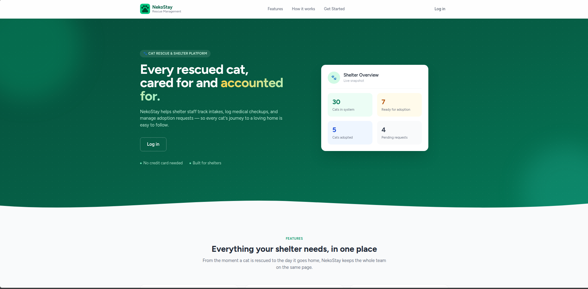 | 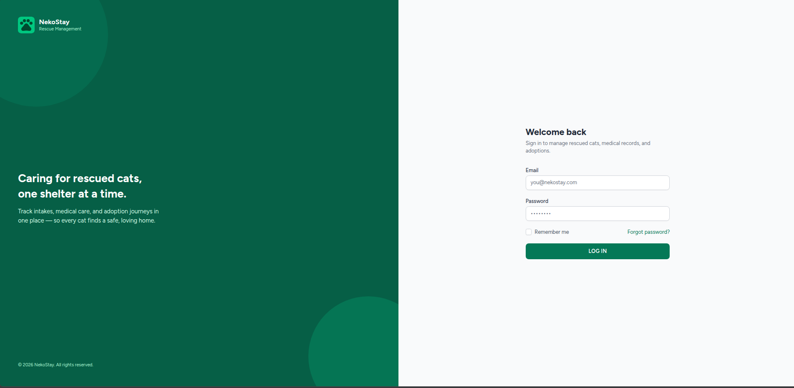 |

### Dashboard

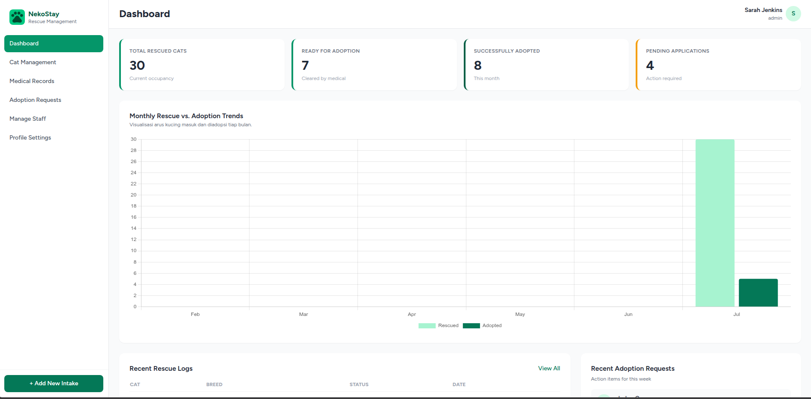

### Cat Management

| Daftar Kucing | Tambah Kucing |
|---|---|
| 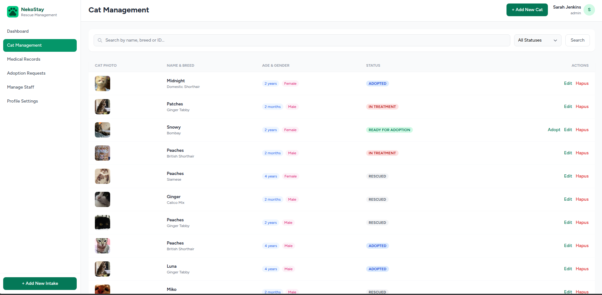 | 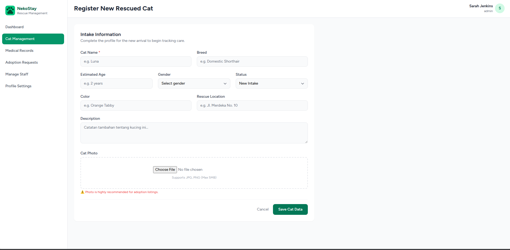 |

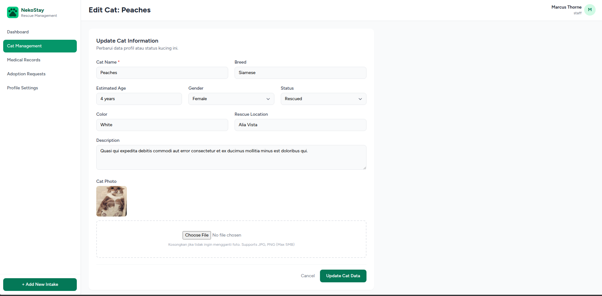

### Medical Records

| Halaman Utama | Tambah Rekam Medis |
|---|---|
| 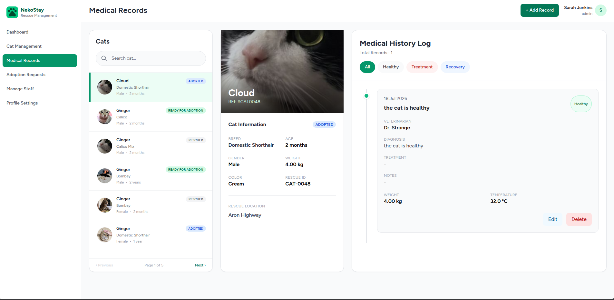 | 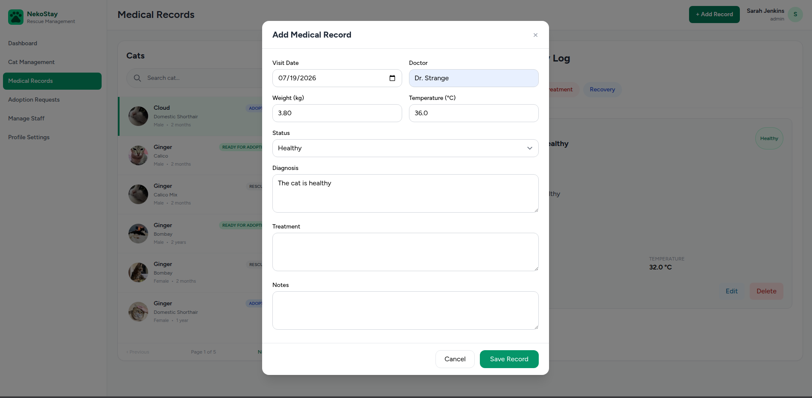 |

### Adoption Requests

| Daftar Pengajuan | Detail Pengajuan |
|---|---|
| 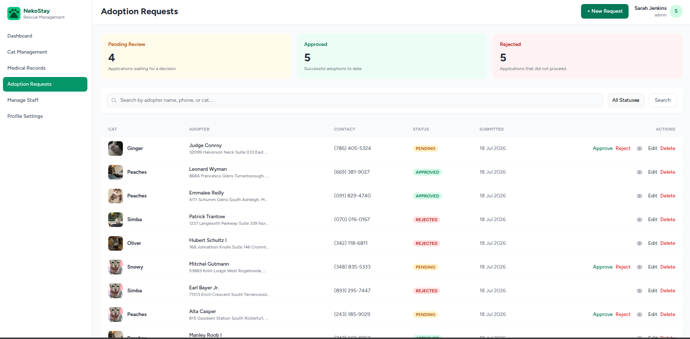 | 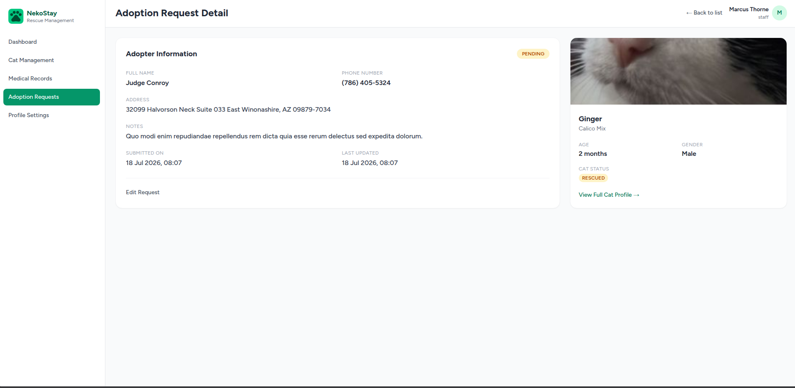 |

| Ajukan Baru | Edit Pengajuan |
|---|---|
| 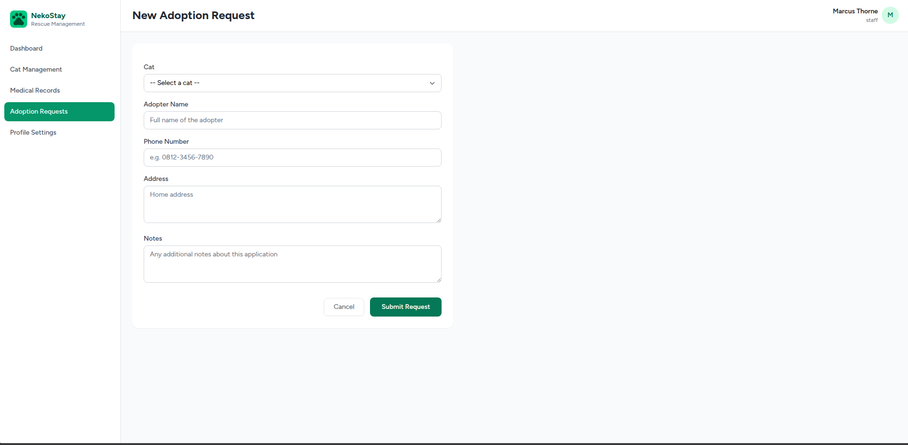 | 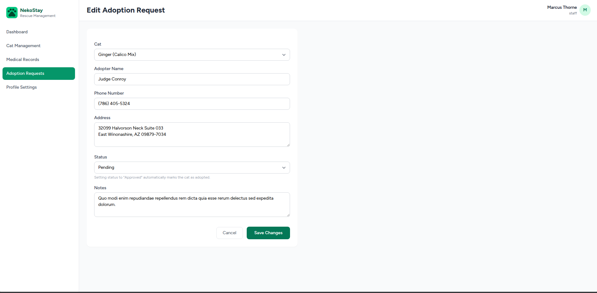 |

### Manage Staff

| Daftar Staff | Tambah Staff |
|---|---|
| 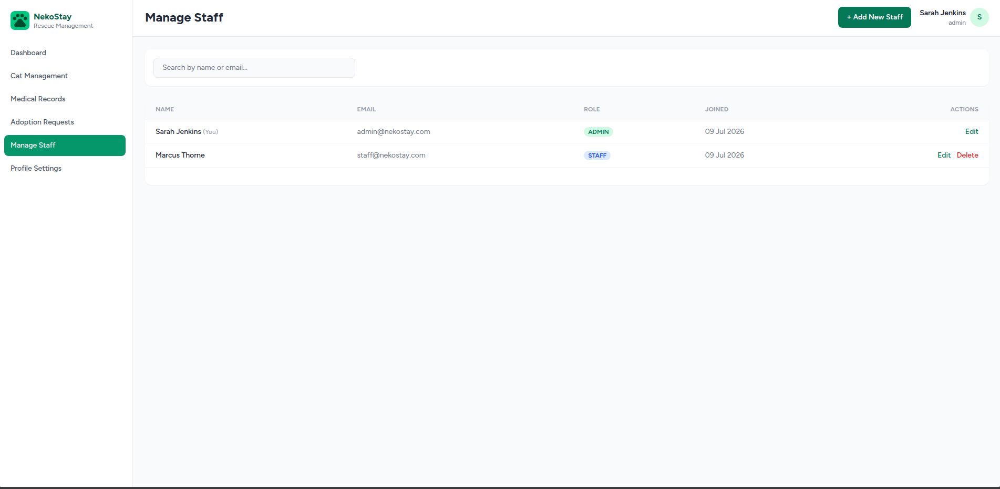 | 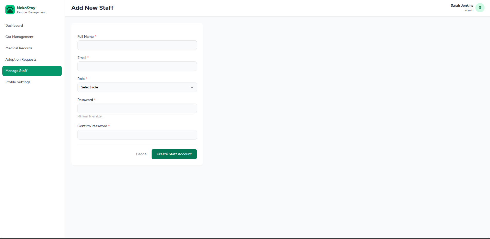 |

### Profile Settings

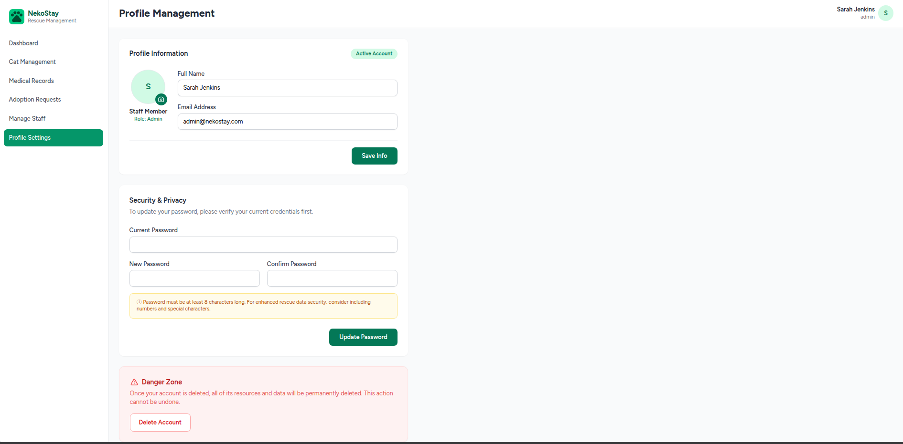
